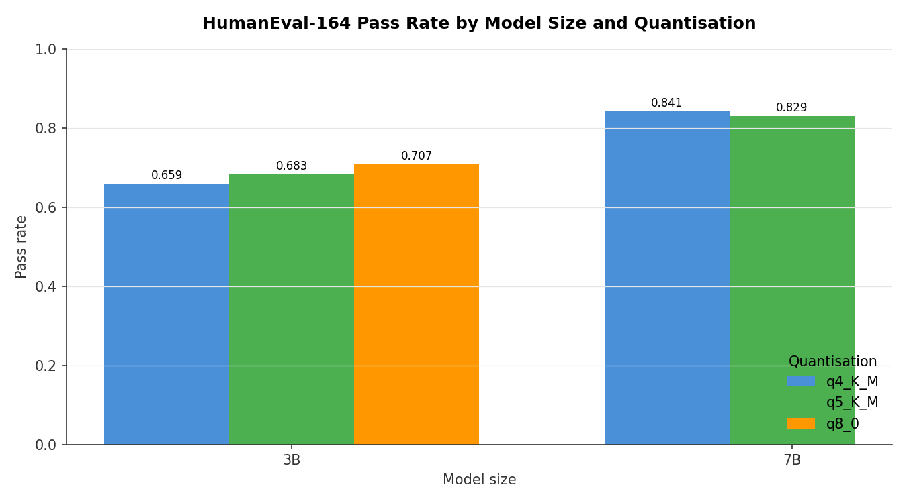
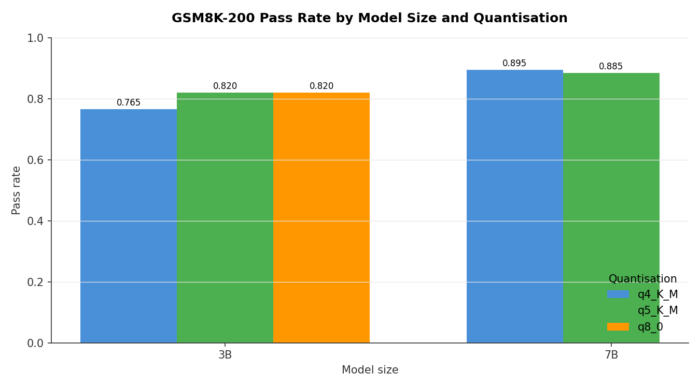

# Benchmark 07: Quality per Quantisation — *Partial*

How much does aggressive quantisation cost in task accuracy? This benchmark runs **HumanEval-164** (code generation, pass@1) and **GSM8K-200** (grade-school math, exact-match) on the full Qwen 2.5 quantisation grid: 3B / 7B / 14B × Q4_K_M / Q5_K_M / Q8_0.

## Status

**PARTIAL — 5 of 9 cells complete.** The run was stopped on user request after the 7B Q5_K_M cell finished. The 3B family is fully covered; the 7B family is missing Q8_0; the entire 14B family is pending.

| Cell | Status |
|---|---|
| 3B Q4_K_M | DONE |
| 3B Q5_K_M | DONE |
| 3B Q8_0 | DONE |
| 7B Q4_K_M | DONE |
| 7B Q5_K_M | DONE |
| 7B Q8_0 | pending |
| 14B Q4_K_M | pending |
| 14B Q5_K_M | pending |
| 14B Q8_0 | pending |

## Hardware

- GPU: NVIDIA GB10 (Blackwell, SM 12.1)
- Memory: 128 GB unified (CPU+GPU via NVLink-C2C)
- CUDA: 13.0, Driver 580.142
- Serving engine: Ollama 0.20.5

## Methodology

- For each Qwen 2.5 instruct quantisation: pull, run HumanEval-164 (164 problems) and GSM8K-200 (200 random problems from the test split), unload, delete from disk before moving on
- HumanEval scored via the standard test-suite execution; pass@1 only (no sampling)
- GSM8K scored by exact-match on the final numeric answer
- Decoding: greedy where supported, single sample
- Each cell takes 4 to 25 minutes depending on model size

## Results

### HumanEval-164 (code, pass rate)

| Size | Q4_K_M | Q5_K_M | Q8_0 |
|------|-------:|-------:|-----:|
| 3B   | 0.659  | 0.683  | 0.707 |
| 7B   | **0.841** | 0.829 | — |
| 14B  | —      | —      | —    |

### GSM8K-200 (math, pass rate)

| Size | Q4_K_M | Q5_K_M | Q8_0 |
|------|-------:|-------:|-----:|
| 3B   | 0.765  | 0.820  | 0.820 |
| 7B   | **0.895** | 0.885 | — |
| 14B  | —      | —      | —    |

### Charts

<div align="center">

<br><sub>HumanEval-164 pass rate. 7B Q4_K_M already beats 3B Q8_0 by 13 points.</sub>
</div>

<div align="center">

<br><sub>GSM8K-200 exact-match. 3B sees a clear jump from Q4 to Q5; 7B Q4 vs Q5 is within noise.</sub>
</div>

### Eval timing

| Model | HumanEval | GSM8K |
|-------|----------:|------:|
| qwen2.5:3b-instruct-q4_K_M | 256s | 535s |
| qwen2.5:3b-instruct-q5_K_M | 303s | 594s |
| qwen2.5:3b-instruct-q8_0   | 383s | 745s |
| qwen2.5:7b-instruct-q4_K_M | 474s | 1,193s |
| qwen2.5:7b-instruct-q5_K_M | 562s | 1,289s |

## Key findings (so far)

- **Stepping up a size class beats stepping up a quant by a wide margin.** 7B Q4_K_M lands at 0.841 / 0.895 versus 3B Q8_0 at 0.707 / 0.820 — going from 3B-Q8 to 7B-Q4 costs less memory than the size jump implies (because the model is more aggressively quantised) and gains 13+ points on HumanEval.
- **Quantisation matters more at smaller sizes.** 3B picks up 5 points HumanEval and 5.5 points GSM8K going Q4 → Q8. At 7B the Q4-to-Q5 difference is 0.012 on HumanEval and 0.010 on GSM8K — within single-judge noise.
- **Practical implication:** if you're choosing between "smaller model at higher quant" vs "bigger model at lower quant" and they fit the same memory budget, the bigger model at lower quant is the right call.

The 14B grid will likely sharpen this picture further; pending completion.

## Files

- `quality_eval.py` — runs HumanEval-164 + GSM8K-200 against an Ollama-hosted model and dumps a JSON with per-problem records and aggregate pass rates.
- `run_all.sh` — orchestrator: iterates the model grid, idempotent (skips cells with an existing JSON), unloads + deletes between cells.
- `generate_charts.py` — reads `results/*.json` and emits the two grouped bar charts above (ATOM white theme).
- `results/` — one JSON per completed cell. Each JSON has full per-problem records plus the aggregate `pass_rate`.
- `charts/` — generated PNGs.

## Reproduce / Resume

The runner is **idempotent** — it skips any cell whose result JSON already exists. To finish the remaining 4 cells:

```bash
cd 07-inference-quality-per-quant

# Make sure Ollama is up
systemctl is-active ollama

# This will skip the 5 already-done cells and run the remaining 4
bash run_all.sh

# Refresh charts
python3 generate_charts.py
```

Estimated time for the remaining 4 cells: ~3–4 hours on GX10 (7B Q8: ~30 min; 14B Q4: ~50 min; 14B Q5: ~60 min; 14B Q8: ~80 min).

## Date

Started 2026-05-09 (3B family) · Resumed 2026-05-09 (7B Q4/Q5) · Stopped 2026-05-09 14:22.

## Created by

Pendakwah Teknologi
