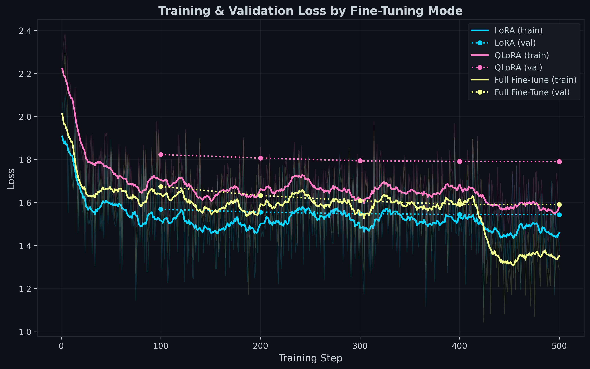
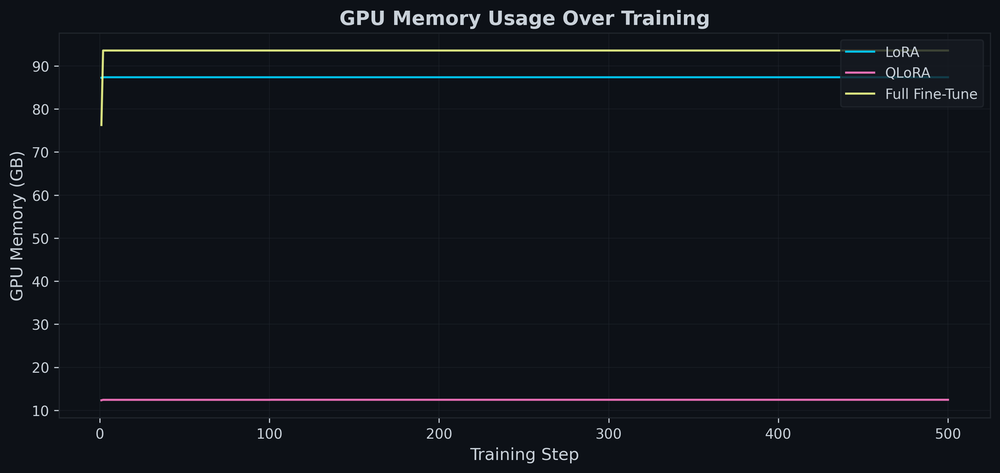

<div align="center">

# ASUS Ascent GX10 Benchmark Suite

### 9 AI Benchmarks on the NVIDIA Grace Blackwell Superchip

**Inference** · **Training** · **Efficiency** · **Image Generation** · **Video Generation** · **Voice** · **Coding**

---

*All images below were generated on this machine in under 25 seconds each.*

<table>
<tr>
<td></td>
<td></td>
<td></td>
</tr>
<tr>
<td align="center"><sub>1024x1024 · 4 steps · 24.3s</sub></td>
<td align="center"><sub>1024x1024 · 4 steps · 24.3s</sub></td>
<td align="center"><sub>1024x1024 · 4 steps · 24.3s</sub></td>
</tr>
</table>

</div>

---

## Hardware

```
NVIDIA GX10 Desktop AI Supercomputer
├── GPU:     NVIDIA GB10 (Blackwell, SM 12.1)
├── CPU:     20 ARM cores (Cortex-X925 + A725)
├── Memory:  128 GB LPDDR5X unified (CPU+GPU via NVLink-C2C)
├── Storage: 916 GB NVMe
├── CUDA:    13.0  ·  Driver: 580.142
└── OS:      Ubuntu 24.04 aarch64
```

> The GB10's **unified memory architecture** means CPU and GPU share the same 128 GB pool via NVLink-C2C. This allows running 72B parameter models and full fine-tuning of 8B models — workloads that are impossible on most desktop GPUs.

---

## Results at a Glance

| # | Benchmark | Highlight | |
|:-:|-----------|-----------|---|
| 01 | **Model Scaling** | 173 tok/s (1.5B) to 4.2 tok/s (72B) — all run | [Details](#01--inference-model-scaling) |
| 02 | **Engine Comparison** | Ollama 43.7 tok/s vs llama.cpp 43.0 vs vLLM 12.5 | [Details](#02--inference-engine-comparison) |
| 03 | **llama.cpp Multi-Quant** | 6,762 tok/s prompt processing (3B Q4) | [Details](#03--inference-llamacpp-multi-quantization) |
| 04 | **Fine-Tuning** | Full FT of Llama 8B in 5h using 93.6 GB | [Details](#04--training-fine-tuning) |
| 05 | **Token per Watt** | 2.62 tok/W peak · RM 0.058 per 1K tokens | [Details](#05--efficiency-token-per-watt) |
| 06 | **Embedding Throughput** | 3,597 chunks/s GPU · 36x faster than CPU | [Details](#06--inference-embedding-throughput) |
| 07 | **Image & Video Gen** | 8.7 images/min · video at 0.56 fps | [Details](#07--image--video-generation) |
| 08 | **Voice STT & TTS** | TTS: 2,017 chars/s · STT: 1.6x realtime | [Details](#08--voice-stt--tts) |
| 09 | **Coding LLM Webpage** | Qwen3-Coder 71 tok/s · full webpage in 62s | [Details](#09--coding-llm-webpage-generation) |

---

## 01 — Inference: Model Scaling

> Every popular model size tested via Ollama. **The 72B model runs** — most desktop GPUs cannot even load it.

| Model | Size | tok/s | TTFT | GPU |
|-------|-----:|------:|-----:|----:|
| Qwen2.5 | 1.5B | **173** | 12ms | 51C |
| Qwen2.5 | 3B | **93** | 19ms | 53C |
| Qwen2.5 | 7B | **43** | 35ms | 51C |
| Qwen2.5 | 14B | 22 | 65ms | 50C |
| Gemma 4 MoE | 27B | **55** | 30ms | 55C |
| Qwen2.5 | 32B | 10 | 134ms | 53C |
| Qwen2.5 | 72B | 4.2 | 296ms | 59C |

<sub>Gemma 4 27B uses MoE (Mixture of Experts), so active parameters per token are lower — hence faster than the dense 14B.</sub>

<details>
<summary>Raw data</summary>

See [`01-inference-model-scaling/results/model-scaling-results.csv`](01-inference-model-scaling/results/model-scaling-results.csv)
</details>

---

## 02 — Inference: Engine Comparison

> Same model (Qwen2.5-7B), three engines. **Ollama wins for single-user speed.** vLLM's advantage is concurrent users (128+), not raw throughput.

| Engine | Runtime | tok/s | GPU |
|--------|---------|------:|----:|
| **Ollama** | Native systemd | **43.7** | 55C |
| **llama.cpp** | Native binary | **43.0** | 44C |
| **vLLM** | Docker container | 12.5 | 63C |

llama.cpp prompt processing: **3,077 tok/s**.

> vLLM runs in Docker because native vLLM doesn't support GB10's SM 12.1 architecture yet.

<details>
<summary>Raw data</summary>

See [`02-inference-engine-comparison/results/engine-comparison-results.csv`](02-inference-engine-comparison/results/engine-comparison-results.csv)
</details>

---

## 03 — Inference: llama.cpp Multi-Quantization

> Full quantization sweep (Q4_K_M / Q5_K_M / Q8_0) across 4 model sizes. All quantizations fit in memory.

| Model | Quant | Prompt Processing | Text Generation |
|-------|-------|------------------:|----------------:|
| **3B** | Q4_K_M | 6,762 tok/s | 94.4 tok/s |
| 3B | Q5_K_M | 6,554 tok/s | 82.5 tok/s |
| 3B | Q8_0 | 6,345 tok/s | 64.1 tok/s |
| **7B** | Q4_K_M | 3,894 tok/s | 44.3 tok/s |
| 7B | Q5_K_M | 3,630 tok/s | 37.4 tok/s |
| 7B | Q8_0 | 2,867 tok/s | 28.8 tok/s |
| **14B** | Q4_K_M | 2,277 tok/s | 22.9 tok/s |
| 14B | Q5_K_M | 2,063 tok/s | 18.7 tok/s |
| 14B | Q8_0 | 1,644 tok/s | 14.2 tok/s |
| **32B** | Q4_K_M | 878 tok/s | 10.2 tok/s |
| 32B | Q5_K_M | 803 tok/s | 8.5 tok/s |
| 32B | Q8_0 | 658 tok/s | 6.3 tok/s |

<details>
<summary>Interactive HTML report</summary>

Download and open [`03-inference-llama-cpp/results/benchmark_report_gx10.html`](03-inference-llama-cpp/results/benchmark_report_gx10.html) for the full interactive report with charts.
</details>

---

## 04 — Training: Fine-Tuning

> Three fine-tuning methods compared on **Llama 3.1 8B Instruct**, same dataset (Dolly 15k), same hyperparameters. Full Fine-Tune uses **93.6 GB of 128 GB unified memory** — only possible because of the GB10's shared CPU+GPU memory pool.

| Mode | Time | Peak Memory | tok/s | Final Loss | Trainable Params |
|------|-----:|------------:|------:|-----------:|:-----------------|
| **LoRA** | 4h 48m | 87.4 GB | **164** | 1.51 | 13.6M (0.17%) |
| **Full FT** | 5h 06m | 93.6 GB | 151 | **1.29** | 8.03B (100%) |
| **QLoRA** | 9h 14m | **12.4 GB** | 83 | 1.61 | 13.6M (0.17%) |

### Training Loss Curves

<div align="center">

<br><sub>Full Fine-Tune achieves the lowest loss. QLoRA converges slowest but uses 7x less memory.</sub>
</div>

### GPU Memory Usage

<div align="center">

<br><sub>QLoRA: 12.4 GB · LoRA: 87.4 GB · Full FT: 93.6 GB — all fit in the GB10's 128 GB unified memory.</sub>
</div>

<details>
<summary>Cross-comparison report</summary>

Download and open [`04-training-finetuning/results/cross_comparison/cross_comparison.html`](04-training-finetuning/results/cross_comparison/cross_comparison.html) for the full interactive comparison with additional charts.
</details>

---

## 05 — Efficiency: Token per Watt

> How much does it cost to run inference? Measured with real-time GPU power monitoring during generation.

| Model | Quant | tok/s | Avg Power | tok/W | Cost per 1M tokens |
|-------|-------|------:|----------:|------:|--------------------:|
| **3B** | Q4_K_M | 95.9 | 36.6W | **2.62** | RM 0.06 |
| 3B | Q5_K_M | 82.5 | 37.5W | 2.20 | RM 0.07 |
| 3B | Q8_0 | 64.0 | 32.7W | 1.96 | RM 0.08 |
| **7B** | Q4_K_M | 44.3 | 40.0W | 1.11 | RM 0.14 |
| 7B | Q8_0 | 28.7 | 33.4W | 0.86 | RM 0.18 |
| **14B** | Q4_K_M | 22.8 | 41.5W | 0.55 | RM 0.28 |
| 14B | Q8_0 | 14.2 | 32.6W | 0.44 | RM 0.35 |
| **32B** | Q4_K_M | 10.1 | 44.3W | 0.23 | RM 0.67 |
| 32B | Q8_0 | 6.3 | 42.8W | 0.15 | RM 1.03 |

<sub>Electricity cost based on Malaysian tariff (RM 0.55/kWh). Running 1 million tokens on the most efficient config costs less than RM 0.06.</sub>

---

## 06 — Inference: Embedding Throughput

> Mesolitica Mistral 191M embedding model — **GPU is 36x faster than CPU**.

| Device | Batch Size | Chunks/s | Power |
|--------|----------:|---------:|------:|
| CPU | 64 | 98 | 13W |
| **GPU** | 32 | 2,810 | 49W |
| **GPU** | 128 | **3,597** | 58W |
| **GPU** | 256 | 3,495 | 59W |

> Batch 128 is the sweet spot — beyond that, throughput plateaus while power increases.

<details>
<summary>Full results with 5000-chunk tests</summary>

| Device | Chunks | Batch | Chunks/s |
|--------|-------:|------:|---------:|
| GPU | 5000 | 32 | 2,811 |
| GPU | 5000 | 64 | 3,465 |
| GPU | 5000 | 128 | **3,597** |
| GPU | 5000 | 256 | 3,495 |

See [`06-inference-embedding/results/embedding-throughput-summary.csv`](06-inference-embedding/results/embedding-throughput-summary.csv)
</details>

---

## 07 — Image & Video Generation

> ComfyUI with **Z-Image-Turbo** (text-to-image, bf16) and **Wan 2.2 T2V 14B** (text-to-video, fp8 + LightX2V LoRA).

### Text-to-Image: Z-Image-Turbo

4 steps, `res_multistep` sampler, bf16 precision.

| Resolution | Time | Images/min | Power |
|------------|-----:|-----------:|------:|
| 512x512 | 6.9s | **8.7** | 83W |
| 768x768 | 14.0s | 4.3 | 69W |
| 1024x1024 | 24.3s | 2.5 | 59W |
| 1280x1280 | 38.3s | 1.6 | 47W |

#### Resolution Comparison

<table>
<tr>
<td align="center"><strong>512x512</strong><br><sub>6.9 seconds</sub></td>
<td align="center"><strong>768x768</strong><br><sub>14.0 seconds</sub></td>
<td align="center"><strong>1024x1024</strong><br><sub>24.3 seconds</sub></td>
<td align="center"><strong>1280x1280</strong><br><sub>38.3 seconds</sub></td>
</tr>
<tr>
<td></td>
<td></td>
<td></td>
<td></td>
</tr>
</table>

#### 4-Step vs 8-Step Quality

<table>
<tr>
<td align="center"><strong>4 steps</strong> · 24.3s</td>
<td align="center"><strong>8 steps</strong> · 47.8s</td>
</tr>
<tr>
<td></td>
<td></td>
</tr>
</table>

<sub>8 steps takes ~2x longer but produces nearly identical output with this turbo model.</sub>

#### More Samples (1024x1024, 4 steps)

<table>
<tr>
<td></td>
<td></td>
<td></td>
</tr>
<tr>
<td align="center"><sub>Futuristic city · 24.3s</sub></td>
<td align="center"><sub>Japanese garden · 24.3s</sub></td>
<td align="center"><sub>City (8 steps) · 47.8s</sub></td>
</tr>
</table>

### Text-to-Video: Wan 2.2 T2V 14B

4 steps with LightX2V LoRA, fp8 precision.

| Resolution | Frames | Time | FPS |
|------------|-------:|-----:|----:|
| 480x480 | 17 | 12.2s* | 1.4 |
| 640x640 | 33 | 59.3s | 0.56 |

<sub>*After model warm-up. First run includes model loading (~183s).</sub>

#### Video Frames (640x640, 33 frames)

<table>
<tr>
<td align="center"><strong>Frame 1</strong></td>
<td align="center"><strong>Frame 34</strong></td>
<td align="center"><strong>Frame 66</strong></td>
</tr>
<tr>
<td></td>
<td></td>
<td></td>
</tr>
</table>

<sub>Prompt: "Ocean waves gently crashing on a tropical beach at golden hour, cinematic slow motion"</sub>

#### Video Frames (480x480, 17 frames)

<table>
<tr>
<td align="center"><strong>Frame 1</strong></td>
<td align="center"><strong>Frame 26</strong></td>
<td align="center"><strong>Frame 51</strong></td>
</tr>
<tr>
<td></td>
<td></td>
<td></td>
</tr>
</table>

<sub>Prompt: "A cat walking gracefully across a sunlit windowsill, smooth camera tracking, natural lighting"</sub>

---

## 08 — Voice: STT & TTS

> **MMS-TTS Malay** (text-to-speech, GPU) and **Whisper large-v3** (speech-to-text, CPU).

### TTS — MMS-TTS Malay

facebook/mms-tts-zlm on GPU. Generates speech **125x faster than realtime**.

| Text | Chars | Synthesis | Audio Output | Chars/s | RTF |
|------|------:|----------:|-------------:|--------:|----:|
| Short | 25 | 0.02s | 2.3s | 478 | 0.010 |
| Medium | 234 | 0.18s | 16.0s | 1,428 | 0.011 |
| Long | 558 | 0.29s | 38.3s | 1,914 | 0.008 |
| Very Long | 1,199 | 0.59s | 77.5s | **2,017** | **0.008** |

<sub>RTF = Real-Time Factor. RTF 0.008 means 1 second of audio is synthesized in 8 milliseconds.</sub>

> Audio samples: [`08-voice-stt-tts/samples/`](08-voice-stt-tts/samples/) — listen to the Malay speech output.

### STT — Whisper large-v3

faster-whisper with CTranslate2 on CPU (int8). Malay language, beam size 5.

| Audio | Transcribe Time | Speed | RTF |
|------:|----------------:|------:|----:|
| 3.6s | 7.8s | 0.5x | 2.15 |
| 10.9s | 10.1s | 1.1x | 0.93 |
| 21.8s | 14.6s | **1.5x** | 0.67 |
| 43.5s | 26.7s | **1.6x** | 0.61 |
| 87.1s | 57.3s | **1.5x** | 0.66 |
| 217.7s | 359.8s | 0.6x | 1.65 |

<sub>CTranslate2 on aarch64 lacks CUDA wheels, so Whisper runs on CPU. GPU inference would be significantly faster. The 300s test shows degraded performance likely due to memory pressure at scale.</sub>

---

## 09 — Coding LLM: Webpage Generation

> Can a local coding LLM generate a complete, working interactive webpage? Three top coding models, one prompt, three runs each. **Qwen3-Coder produces a full 3D solar system in 62 seconds.**

The prompt asks each model to build an interactive 3D solar system visualization — pure HTML/CSS/JS, no libraries — with orbiting planets, click-to-inspect info cards, speed controls, view toggles, and a starfield background.

| Model | Params | VRAM | tok/s | Gen Time | Output |
|-------|-------:|-----:|------:|---------:|-------:|
| **Qwen3-Coder** | 30B | 18 GB | **71.1** | **62s** | 18.2 KB |
| DeepCoder | 14B | 9 GB | 22.4 | 129s | 8.8 KB |
| Devstral | 24B | 14 GB | 14.0 | 213s | 10.4 KB |

**Key findings:**
- Qwen3-Coder is **5x faster** than Devstral and generates the richest output (550+ lines, most features implemented)
- All 9 runs (3 models x 3 each) produced valid, runnable HTML
- Warm time-to-first-token under 250ms for all models
- Even the largest model (30B, 18 GB) leaves **110 GB of headroom** in the GX10's unified memory

<details>
<summary>All runs (raw data)</summary>

| Model | Run | tok/s | Gen Time | Tokens | HTML Size |
|-------|----:|------:|---------:|-------:|----------:|
| Qwen3-Coder:30B | 1 | 71.1 | 61.3s | 4,360 | 18,208 B |
| Qwen3-Coder:30B | 2 | 72.4 | 46.8s | 3,393 | 13,359 B |
| Qwen3-Coder:30B | 3 | 70.7 | 62.9s | 4,448 | 18,977 B |
| Devstral:24B | 1 | 14.0 | 212.6s | 2,978 | 11,776 B |
| Devstral:24B | 2 | 14.0 | 214.0s | 2,998 | 9,442 B |
| Devstral:24B | 3 | 14.0 | 211.3s | 2,965 | 10,372 B |
| DeepCoder:14B | 1 | 22.4 | 134.9s | 3,022 | 9,392 B |
| DeepCoder:14B | 2 | 22.5 | 122.4s | 2,751 | 8,817 B |
| DeepCoder:14B | 3 | 22.4 | 129.4s | 2,903 | 8,133 B |

</details>

<details>
<summary>Interactive HTML report</summary>

Download and open [`09-coding-llm-webpage/index.html`](09-coding-llm-webpage/index.html) for the full interactive report with charts and live previews of each model's generated webpage.
</details>

---

## Repository Structure

```
gx10-benchmarks/
├── 01-inference-model-scaling/        Ollama · 7 models · 1.5B to 72B
├── 02-inference-engine-comparison/    Ollama vs llama.cpp vs vLLM
├── 03-inference-llama-cpp/            Q4/Q5/Q8 · 3B to 32B · with reports
├── 04-training-finetuning/            LoRA · QLoRA · Full FT · with charts
├── 05-efficiency-token-per-watt/      Power monitoring · cost analysis
├── 06-inference-embedding/            CPU vs GPU · batch size sweep
├── 07-image-video-generation/         Z-Image-Turbo · Wan 2.2 T2V · samples
├── 08-voice-stt-tts/                  Whisper STT · MMS-TTS · audio samples
└── 09-coding-llm-webpage/            3 coding LLMs · webpage generation · live outputs
```

Each benchmark includes:
- **README.md** — methodology and configuration
- **run.sh / benchmark.py** — fully reproducible scripts
- **results/** — raw CSVs, JSON metadata, HTML reports, logs
- **samples/** — generated images, video frames, or audio

## Reproducibility

All benchmarks were run on the same GX10 hardware with no other GPU workloads active. To reproduce:

1. Set up the required software per each benchmark's README
2. Download the required models
3. Run `./run.sh` or `python3 benchmark.py`
4. Compare your results against the CSVs in `results/`

## License

MIT

---

<div align="center">
<sub>Pendakwah Teknologi · April 2026 · All benchmarks run on NVIDIA GX10 (GB10 Grace Blackwell)</sub>
</div>
