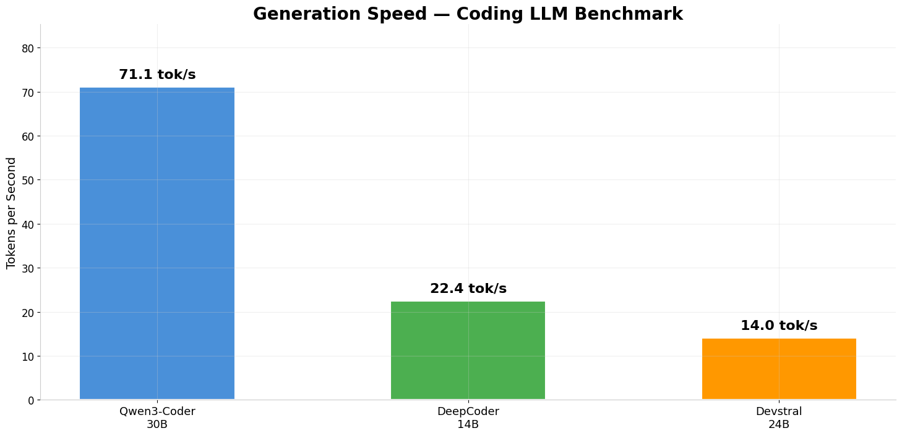
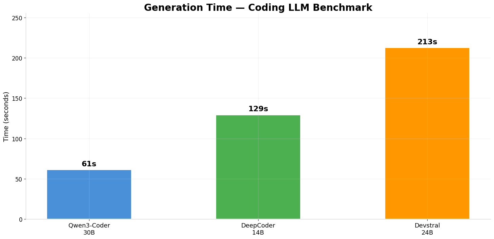
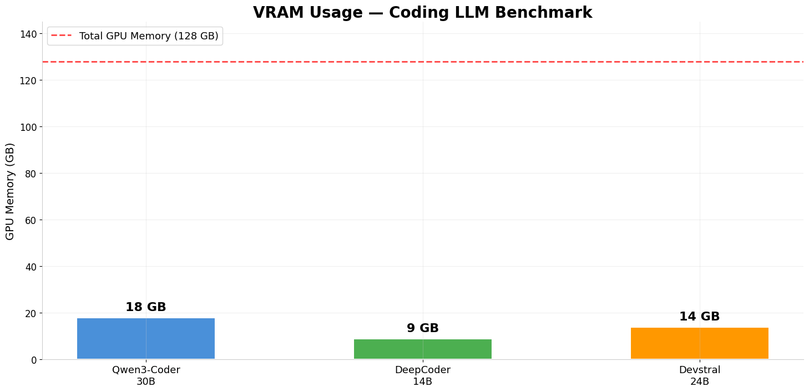
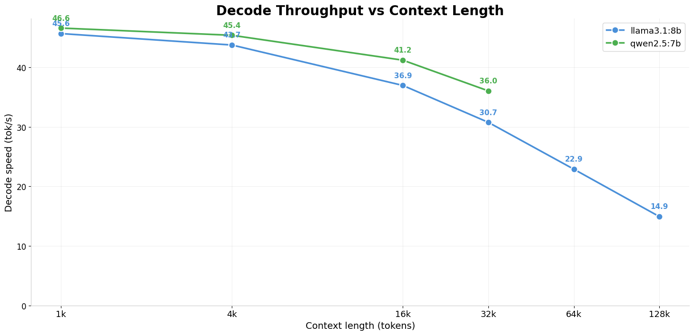
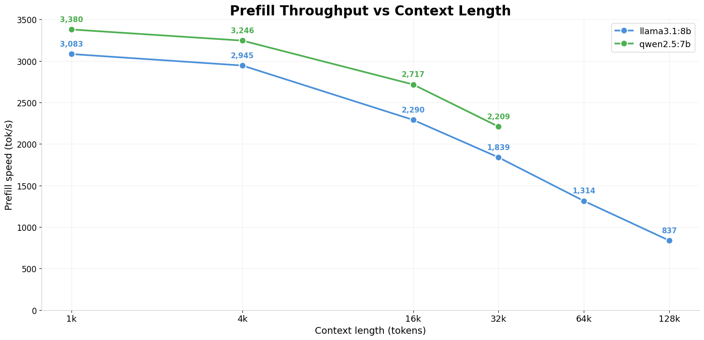
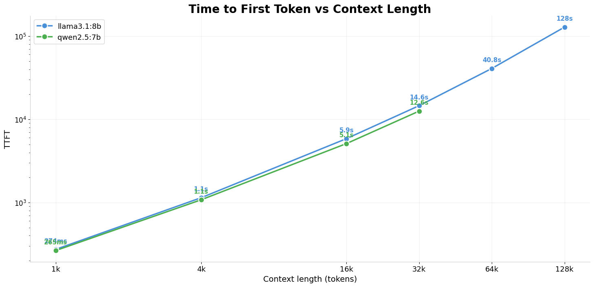
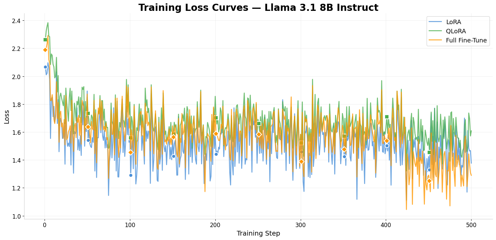
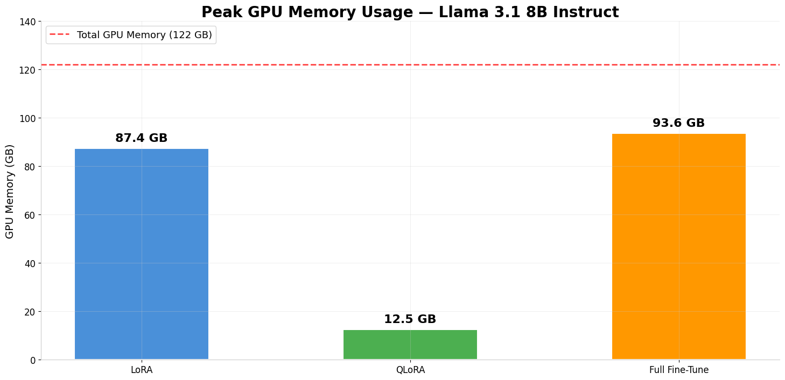

<div align="center">

# ASUS Ascent GX10 Benchmark Suite

### 15 AI Benchmarks on the NVIDIA Grace Blackwell Superchip

**Inference** · **Training** · **Efficiency** · **Generation** · **Voice** · **Multimodal**

---

*All images below were generated on this machine in under 25 seconds each.*

<table>
<tr>
<td></td>
<td></td>
<td></td>
</tr>
<tr>
<td align="center"><sub>1024x1024 · 4 steps · 24.3s</sub></td>
<td align="center"><sub>1024x1024 · 4 steps · 24.3s</sub></td>
<td align="center"><sub>1024x1024 · 4 steps · 24.3s</sub></td>
</tr>
</table>

</div>

---

## Hardware

```
NVIDIA GX10 Desktop AI Supercomputer
├── GPU:     NVIDIA GB10 (Blackwell, SM 12.1)
├── CPU:     20 ARM cores (Cortex-X925 + A725)
├── Memory:  128 GB LPDDR5X unified (CPU+GPU via NVLink-C2C)
├── Storage: 916 GB NVMe
├── CUDA:    13.0  ·  Driver: 580.142
└── OS:      Ubuntu 24.04 aarch64
```

> The GB10's **unified memory architecture** means CPU and GPU share the same 128 GB pool via NVLink-C2C. This allows running 72B parameter models and full fine-tuning of 8B models — workloads that are impossible on most desktop GPUs.

---

## Suite Status

> 9 done · 1 partial · 5 planned. Canonical roster lives in [`BENCHMARKS.md`](BENCHMARKS.md). The README is updated as each benchmark transitions.

## Results at a Glance

| # | Category | Benchmark | Status | Highlight |
|:-:|----------|-----------|:------:|-----------|
| 01 | Inference | **Model Scaling** | DONE | 173 tok/s (1.5B) → 4.2 tok/s (72B) — all run |
| 02 | Inference | **Engine Comparison** | DONE | Ollama 43.7 · llama.cpp 43.0 · vLLM 12.5 |
| 03 | Inference | **llama.cpp Multi-Quant** | DONE | 6,762 tok/s prompt processing (3B Q4) |
| 04 | Inference | **Embedding Throughput** | DONE | 3,597 chunks/s GPU · 36× faster than CPU |
| 05 | Inference | **Coding LLM Webpage** | DONE | Qwen3-Coder 71 tok/s · full webpage in 62s |
| 06 | Inference | **Long-Context Scaling** | DONE | Llama 3.1 8B · 128K input · 14.9 tok/s decode |
| 07 | Inference | **Quality per Quant** | PARTIAL | 7B Q4 hits HumanEval 0.841 / GSM8K 0.895 (5 of 9 cells done) |
| 08 | Inference | **Model Breadth** | PLANNED | Llama 3.x + Gemma 3 family, 1B → 70B |
| 09 | Inference | **vLLM Concurrency** | PLANNED | concurrent users 1 → 128 |
| 10 | Training | **Fine-Tuning** | DONE | Full FT of Llama 8B in 5h using 93.6 GB |
| 11 | Efficiency | **Token per Watt** | DONE | 2.62 tok/W peak · RM 0.058 per 1M tokens |
| 12 | Efficiency | **Multi-Model Concurrent** | PLANNED | 3 models loaded simultaneously |
| 13 | Generation | **Image & Video** | DONE | 8.7 images/min · video at 0.56 fps |
| 14 | Voice | **STT & TTS** | DONE | TTS 2,017 chars/s · STT 1.6× realtime |
| 15 | Multimodal | **Vision-Language** | PLANNED | Qwen 2-VL + LLaVA |

---

## 01 — Inference: Model Scaling

> Every popular model size tested via Ollama. **The 72B model runs** — most desktop GPUs cannot even load it.

| Model | Size | tok/s | TTFT | GPU |
|-------|-----:|------:|-----:|----:|
| Qwen2.5 | 1.5B | **173** | 12ms | 51C |
| Qwen2.5 | 3B | **93** | 19ms | 53C |
| Qwen2.5 | 7B | **43** | 35ms | 51C |
| Qwen2.5 | 14B | 22 | 65ms | 50C |
| Gemma 4 | 8B (4B active) | **55** | 30ms | 55C |
| Qwen2.5 | 32B | 10 | 134ms | 53C |
| Qwen2.5 | 72B | 4.2 | 296ms | 59C |

<sub>Gemma 4 (E4B) uses selective activation — ~4B effective active parameters per token despite ~8B total — so it runs faster than the dense 14B.</sub>

<details>
<summary>Raw data</summary>

See [`01-inference-model-scaling/results/model-scaling-results.csv`](01-inference-model-scaling/results/model-scaling-results.csv)
</details>

---

## 02 — Inference: Engine Comparison

> Same model (Qwen2.5-7B), three engines. **Ollama wins for single-user speed.** vLLM's advantage is concurrent users (128+), not raw throughput — see bench 09 for the concurrency sweep.

| Engine | Runtime | tok/s | GPU |
|--------|---------|------:|----:|
| **Ollama** | Native systemd | **43.7** | 55C |
| **llama.cpp** | Native binary | **43.0** | 44C |
| **vLLM** | Docker container | 12.5 | 63C |

llama.cpp prompt processing: **3,077 tok/s**.

> vLLM runs in Docker because native vLLM doesn't support GB10's SM 12.1 architecture yet.

<details>
<summary>Raw data</summary>

See [`02-inference-engine-comparison/results/engine-comparison-results.csv`](02-inference-engine-comparison/results/engine-comparison-results.csv)
</details>

---

## 03 — Inference: llama.cpp Multi-Quantization

> Full quantization sweep (Q4_K_M / Q5_K_M / Q8_0) across 4 model sizes. All quantizations fit in memory.

| Model | Quant | Prompt Processing | Text Generation |
|-------|-------|------------------:|----------------:|
| **3B** | Q4_K_M | 6,762 tok/s | 94.4 tok/s |
| 3B | Q5_K_M | 6,554 tok/s | 82.5 tok/s |
| 3B | Q8_0 | 6,345 tok/s | 64.1 tok/s |
| **7B** | Q4_K_M | 3,894 tok/s | 44.3 tok/s |
| 7B | Q5_K_M | 3,630 tok/s | 37.4 tok/s |
| 7B | Q8_0 | 2,867 tok/s | 28.8 tok/s |
| **14B** | Q4_K_M | 2,277 tok/s | 22.9 tok/s |
| 14B | Q5_K_M | 2,063 tok/s | 18.7 tok/s |
| 14B | Q8_0 | 1,644 tok/s | 14.2 tok/s |
| **32B** | Q4_K_M | 878 tok/s | 10.2 tok/s |
| 32B | Q5_K_M | 803 tok/s | 8.5 tok/s |
| 32B | Q8_0 | 658 tok/s | 6.3 tok/s |

<details>
<summary>Interactive HTML report</summary>

Download and open [`03-inference-llama-cpp/results/benchmark_report_gx10.html`](03-inference-llama-cpp/results/benchmark_report_gx10.html) for the full interactive report with charts.
</details>

---

## 04 — Inference: Embedding Throughput

> Mesolitica Mistral 191M embedding model — **GPU is 36× faster than CPU**.

| Device | Batch Size | Chunks/s | Power |
|--------|----------:|---------:|------:|
| CPU | 64 | 98 | 13W |
| **GPU** | 32 | 2,810 | 49W |
| **GPU** | 128 | **3,597** | 58W |
| **GPU** | 256 | 3,495 | 59W |

> Batch 128 is the sweet spot — beyond that, throughput plateaus while power increases.

<details>
<summary>Full results with 5000-chunk tests</summary>

| Device | Chunks | Batch | Chunks/s |
|--------|-------:|------:|---------:|
| GPU | 5000 | 32 | 2,811 |
| GPU | 5000 | 64 | 3,465 |
| GPU | 5000 | 128 | **3,597** |
| GPU | 5000 | 256 | 3,495 |

See [`04-inference-embedding-throughput/results/embedding-throughput-summary.csv`](04-inference-embedding-throughput/results/embedding-throughput-summary.csv)
</details>

---

## 05 — Inference: Coding LLM Webpage Generation

> Can a local coding LLM generate a complete, working interactive webpage? Three top coding models, one prompt, three runs each. **Qwen3-Coder produces a full 3D solar system in 62 seconds.**

The prompt asks each model to build an interactive 3D solar system visualization — pure HTML/CSS/JS, no libraries — with orbiting planets, click-to-inspect info cards, speed controls, view toggles, and a starfield background.

| Model | Params | VRAM | tok/s | Gen Time | Output |
|-------|-------:|-----:|------:|---------:|-------:|
| **Qwen3-Coder** | 30B | 18 GB | **71.1** | **62s** | 18.2 KB |
| DeepCoder | 14B | 9 GB | 22.4 | 129s | 8.8 KB |
| Devstral | 24B | 14 GB | 14.0 | 213s | 10.4 KB |

### Generation Speed

<div align="center">

<br><sub>Qwen3-Coder is 5× faster than Devstral and 3× faster than DeepCoder.</sub>
</div>

### Generation Time & VRAM Usage

<div align="center">

<br><sub>Qwen3-Coder generates a full interactive webpage in just 61 seconds.</sub>
</div>

<div align="center">

<br><sub>Even the largest model (30B, 18 GB) leaves 110 GB of headroom in the GB10's unified memory.</sub>
</div>

**Key findings:**
- Qwen3-Coder is **5× faster** than Devstral and generates the richest output (550+ lines, most features implemented)
- All 9 runs (3 models × 3 each) produced valid, runnable HTML
- Warm time-to-first-token under 250ms for all models
- Even the largest model (30B, 18 GB) leaves **110 GB of headroom** in the GX10's unified memory

<details>
<summary>All runs (raw data)</summary>

| Model | Run | tok/s | Gen Time | Tokens | HTML Size |
|-------|----:|------:|---------:|-------:|----------:|
| Qwen3-Coder:30B | 1 | 71.1 | 61.3s | 4,360 | 18,208 B |
| Qwen3-Coder:30B | 2 | 72.4 | 46.8s | 3,393 | 13,359 B |
| Qwen3-Coder:30B | 3 | 70.7 | 62.9s | 4,448 | 18,977 B |
| Devstral:24B | 1 | 14.0 | 212.6s | 2,978 | 11,776 B |
| Devstral:24B | 2 | 14.0 | 214.0s | 2,998 | 9,442 B |
| Devstral:24B | 3 | 14.0 | 211.3s | 2,965 | 10,372 B |
| DeepCoder:14B | 1 | 22.4 | 134.9s | 3,022 | 9,392 B |
| DeepCoder:14B | 2 | 22.5 | 122.4s | 2,751 | 8,817 B |
| DeepCoder:14B | 3 | 22.4 | 129.4s | 2,903 | 8,133 B |

</details>

<details>
<summary>Interactive HTML report</summary>

Download and open [`05-inference-coding-llm-webpage/index.html`](05-inference-coding-llm-webpage/index.html) for the full interactive report with charts and live previews of each model's generated webpage.
</details>

---

## 06 — Inference: Long-Context Scaling

> How fast does prefill and decode degrade as the input context grows from 1K to 128K tokens? **Llama 3.1 8B serves a full 128K context — 107K input tokens prefilled — without any out-of-memory failure or KV-cache eviction.**

Two models swept across 1K, 4K, 16K, 32K, 64K, 128K input tokens (3 runs each). The GB10's 128 GB unified memory absorbs the KV-cache growth that conventional 24 GB-class GPUs cannot.

### Llama 3.1 8B — full 1K → 128K sweep

| Target ctx | Prompt tokens | Prefill tok/s | Decode tok/s | TTFT |
|-----------:|--------------:|--------------:|-------------:|-----:|
|       1K |           844 |         3,085 |         45.7 |   0.27s |
|       4K |         3,364 |         2,947 |         43.7 |   1.14s |
|      16K |        13,415 |         2,298 |         36.8 |   5.84s |
|      32K |        26,827 |         1,845 |         30.7 |  14.54s |
|      64K |        53,645 |         1,315 |         22.9 |  40.79s |
|     128K |       107,279 |           838 |         14.9 | 128.06s |

### Qwen 2.5 7B — 1K → 32K

| Target ctx | Prompt tokens | Prefill tok/s | Decode tok/s | TTFT |
|-----------:|--------------:|--------------:|-------------:|-----:|
|       1K |           895 |         3,374 |         46.6 |   0.27s |
|       4K |         3,499 |         3,245 |         45.3 |   1.08s |
|      16K |        13,879 |         2,727 |         41.2 |   5.09s |
|      32K |        27,735 |         2,215 |         36.1 |  12.52s |

### Decode and Prefill Throughput

<div align="center">

<br><sub>Decode throughput halves roughly every 4× context growth. Both models stay above 30 tok/s up to 32K.</sub>
</div>

<div align="center">

<br><sub>Prefill throughput drops as context grows; even at 128K, Llama 3.1 8B sustains ~840 tok/s prefill.</sub>
</div>

### TTFT (Time to First Token)

<div align="center">

<br><sub>TTFT is the real cost of long context: 0.27s at 1K, 14.5s at 32K, 128s at 128K. Long-context summarization is prefill-bound.</sub>
</div>

**Key findings:**
- **No memory cliff.** Both models served 32K cleanly and Llama 3.1 8B served 128K without OOM or KV-cache eviction. This usually requires 80 GB-class data-center GPUs.
- **Decode degrades gracefully.** Llama 3.1 8B at 128K still decodes at 14.9 tok/s — a ~3× slowdown across a 128× context expansion.
- **Sweet spot is 1K–16K.** Sub-6s TTFT, 36+ tok/s decode. Below 4K everything feels real-time; at 32K you're sending the prompt and grabbing coffee.
- **Qwen 2.5 7B is 10–20% faster than Llama 3.1 8B at matched ctx** in the 1K–32K range tested — the 1B-parameter difference matters more than the architecture difference here.

<details>
<summary>Full benchmark page</summary>

See [`06-inference-long-context-scaling/README.md`](06-inference-long-context-scaling/README.md) for methodology, per-model charts, raw CSVs, and reproduction instructions.
</details>

---

## 07 — Inference: Quality per Quant — *Partial (5 of 9 cells)*

> HumanEval-164 (code) and GSM8K-200 (math) pass rates across the Qwen 2.5 quantisation grid: **3B / 7B / 14B × Q4_K_M / Q5_K_M / Q8_0**. Run was stopped after the 7B-Q5 cell completed; the 14B family and 7B Q8_0 are still pending.

### HumanEval-164 (pass rate)

| Size | Q4_K_M | Q5_K_M | Q8_0 |
|------|-------:|-------:|-----:|
| 3B   | 0.659  | 0.683  | 0.707 |
| 7B   | **0.841** | 0.829 | — |
| 14B  | —      | —      | —    |

### GSM8K-200 (pass rate)

| Size | Q4_K_M | Q5_K_M | Q8_0 |
|------|-------:|-------:|-----:|
| 3B   | 0.765  | 0.820  | 0.820 |
| 7B   | **0.895** | 0.885 | — |
| 14B  | —      | —      | —    |

<div align="center">

<br><sub>7B Q4_K_M already beats 3B Q8_0 by 13 points on HumanEval.</sub>
</div>

<div align="center">

<br><sub>3B sees a clear Q4 → Q5 jump on GSM8K; at 7B the Q4-vs-Q5 gap is within noise.</sub>
</div>

**Key findings (partial):**
- **Stepping up a size class beats stepping up a quant.** 7B Q4 (0.841 / 0.895) beats 3B Q8 (0.707 / 0.820) by 13+ points on HumanEval and 7+ on GSM8K — and the 7B-Q4 model is roughly the same memory footprint as 3B-Q8.
- **Quantisation matters more at smaller sizes.** 3B picks up 5 points HE / 5.5 GSM going Q4 → Q8. At 7B the Q4-to-Q5 difference is 0.012 / 0.010 — single-judge noise.
- **Practical takeaway:** when memory is fixed, prefer the bigger model at lower quant.

The runner is idempotent — see [`07-inference-quality-per-quant/README.md`](07-inference-quality-per-quant/README.md) for the resume command. The remaining 4 cells take ~3–4 hours.

---

## 08 — Inference: Model Breadth — *Planned*

> Companion to bench 01: tok/s and TTFT for the **Llama 3.x and Gemma 3 families** at every published size (1B → 70B). Mirrors bench 01's methodology so the two can be read side by side as a complete model-family map.

Models targeted: `llama3.2:1b`, `llama3.2:3b`, `llama3.1:8b`, `gemma3:1b-it`, `gemma3:4b-it`, `gemma3:12b-it`, `gemma3:27b-it`, `llama3.3:70b`.

---

## 09 — Inference: vLLM Concurrency — *Planned*

> Same model (Qwen 2.5 7B), one engine (vLLM in Docker — `scitrera/dgx-spark-vllm:0.15.1-t4`, custom-built for SM 12.1), concurrency swept **1 → 128**. Captures aggregate throughput, per-request p50/p95 latency, and where the GX10 plateaus.

This is the question bench 02 doesn't answer — vLLM is slow at concurrency 1, but its real value is concurrent users. Bench 09 tells you where that crossover sits and how high it can go on this hardware.

---

## 10 — Training: Fine-Tuning

> Three fine-tuning methods compared on **Llama 3.1 8B Instruct**, same dataset (Dolly 15k), same hyperparameters. Full Fine-Tune uses **93.6 GB of 128 GB unified memory** — only possible because of the GB10's shared CPU+GPU memory pool.

| Mode | Time | Peak Memory | tok/s | Final Loss | Trainable Params |
|------|-----:|------------:|------:|-----------:|:-----------------|
| **LoRA** | 4h 48m | 87.4 GB | **164** | 1.51 | 13.6M (0.17%) |
| **Full FT** | 5h 06m | 93.6 GB | 151 | **1.29** | 8.03B (100%) |
| **QLoRA** | 9h 14m | **12.4 GB** | 83 | 1.61 | 13.6M (0.17%) |

### Training Loss Curves

<div align="center">

<br><sub>Full Fine-Tune achieves the lowest loss. QLoRA converges slowest but uses 7× less memory.</sub>
</div>

### GPU Memory Usage

<div align="center">

<br><sub>QLoRA: 12.4 GB · LoRA: 87.4 GB · Full FT: 93.6 GB — all fit in the GB10's 128 GB unified memory.</sub>
</div>

<details>
<summary>Cross-comparison report</summary>

Download and open [`10-training-finetuning/results/cross_comparison/cross_comparison.html`](10-training-finetuning/results/cross_comparison/cross_comparison.html) for the full interactive comparison with additional charts.
</details>

---

## 11 — Efficiency: Token per Watt

> How much does it cost to run inference? Measured with real-time GPU power monitoring during generation.

| Model | Quant | tok/s | Avg Power | tok/W | Cost per 1M tokens |
|-------|-------|------:|----------:|------:|--------------------:|
| **3B** | Q4_K_M | 95.9 | 36.6W | **2.62** | RM 0.06 |
| 3B | Q5_K_M | 82.5 | 37.5W | 2.20 | RM 0.07 |
| 3B | Q8_0 | 64.0 | 32.7W | 1.96 | RM 0.08 |
| **7B** | Q4_K_M | 44.3 | 40.0W | 1.11 | RM 0.14 |
| 7B | Q8_0 | 28.7 | 33.4W | 0.86 | RM 0.18 |
| **14B** | Q4_K_M | 22.8 | 41.5W | 0.55 | RM 0.28 |
| 14B | Q8_0 | 14.2 | 32.6W | 0.44 | RM 0.35 |
| **32B** | Q4_K_M | 10.1 | 44.3W | 0.23 | RM 0.67 |
| 32B | Q8_0 | 6.3 | 42.8W | 0.15 | RM 1.03 |

<sub>Electricity cost based on Malaysian tariff (RM 0.55/kWh). Running 1 million tokens on the most efficient config costs less than RM 0.06.</sub>

---

## 12 — Efficiency: Multi-Model Concurrent Serving — *Planned*

> Load three different models simultaneously (chat + coding + vision-language, ~50 GB combined) and drive each at 5–10 req/s. Measures cross-tenant aggregate throughput and the cost of serving multiple models from one shared 128 GB pool.

This benchmark is the one that **directly demonstrates** GX10's unified-memory advantage — none of the existing benchmarks force two large models to coexist. Coming after the running pipeline finishes.

---

## 13 — Generation: Image & Video

> ComfyUI with **Z-Image-Turbo** (text-to-image, bf16) and **Wan 2.2 T2V 14B** (text-to-video, fp8 + LightX2V LoRA).

### Text-to-Image: Z-Image-Turbo

4 steps, `res_multistep` sampler, bf16 precision.

| Resolution | Time | Images/min | Power |
|------------|-----:|-----------:|------:|
| 512x512 | 6.9s | **8.7** | 83W |
| 768x768 | 14.0s | 4.3 | 69W |
| 1024x1024 | 24.3s | 2.5 | 59W |
| 1280x1280 | 38.3s | 1.6 | 47W |

#### Resolution Comparison

<table>
<tr>
<td align="center"><strong>512x512</strong><br><sub>6.9 seconds</sub></td>
<td align="center"><strong>768x768</strong><br><sub>14.0 seconds</sub></td>
<td align="center"><strong>1024x1024</strong><br><sub>24.3 seconds</sub></td>
<td align="center"><strong>1280x1280</strong><br><sub>38.3 seconds</sub></td>
</tr>
<tr>
<td></td>
<td></td>
<td></td>
<td></td>
</tr>
</table>

#### 4-Step vs 8-Step Quality

<table>
<tr>
<td align="center"><strong>4 steps</strong> · 24.3s</td>
<td align="center"><strong>8 steps</strong> · 47.8s</td>
</tr>
<tr>
<td></td>
<td></td>
</tr>
</table>

<sub>8 steps takes ~2× longer but produces nearly identical output with this turbo model.</sub>

#### More Samples (1024x1024, 4 steps)

<table>
<tr>
<td></td>
<td></td>
<td></td>
</tr>
<tr>
<td align="center"><sub>Futuristic city · 24.3s</sub></td>
<td align="center"><sub>Japanese garden · 24.3s</sub></td>
<td align="center"><sub>City (8 steps) · 47.8s</sub></td>
</tr>
</table>

### Text-to-Video: Wan 2.2 T2V 14B

4 steps with LightX2V LoRA, fp8 precision.

| Resolution | Frames | Time | FPS |
|------------|-------:|-----:|----:|
| 480x480 | 17 | 12.2s* | 1.4 |
| 640x640 | 33 | 59.3s | 0.56 |

<sub>*After model warm-up. First run includes model loading (~183s).</sub>

#### Video Frames (640x640, 33 frames)

<table>
<tr>
<td align="center"><strong>Frame 1</strong></td>
<td align="center"><strong>Frame 34</strong></td>
<td align="center"><strong>Frame 66</strong></td>
</tr>
<tr>
<td></td>
<td></td>
<td></td>
</tr>
</table>

<sub>Prompt: "Ocean waves gently crashing on a tropical beach at golden hour, cinematic slow motion"</sub>

#### Video Frames (480x480, 17 frames)

<table>
<tr>
<td align="center"><strong>Frame 1</strong></td>
<td align="center"><strong>Frame 26</strong></td>
<td align="center"><strong>Frame 51</strong></td>
</tr>
<tr>
<td></td>
<td></td>
<td></td>
</tr>
</table>

<sub>Prompt: "A cat walking gracefully across a sunlit windowsill, smooth camera tracking, natural lighting"</sub>

---

## 14 — Voice: STT & TTS

> **MMS-TTS Malay** (text-to-speech, GPU) and **Whisper large-v3** (speech-to-text, CPU).

### TTS — MMS-TTS Malay

facebook/mms-tts-zlm on GPU. Generates speech **125× faster than realtime**.

| Text | Chars | Synthesis | Audio Output | Chars/s | RTF |
|------|------:|----------:|-------------:|--------:|----:|
| Short | 25 | 0.02s | 2.3s | 478 | 0.010 |
| Medium | 234 | 0.18s | 16.0s | 1,428 | 0.011 |
| Long | 558 | 0.29s | 38.3s | 1,914 | 0.008 |
| Very Long | 1,199 | 0.59s | 77.5s | **2,017** | **0.008** |

<sub>RTF = Real-Time Factor. RTF 0.008 means 1 second of audio is synthesized in 8 milliseconds.</sub>

> Audio samples: [`14-voice-stt-tts/samples/`](14-voice-stt-tts/samples/) — listen to the Malay speech output.

### STT — Whisper large-v3

faster-whisper with CTranslate2 on CPU (int8). Malay language, beam size 5.

| Audio | Transcribe Time | Speed | RTF |
|------:|----------------:|------:|----:|
| 3.6s | 7.8s | 0.5× | 2.15 |
| 10.9s | 10.1s | 1.1× | 0.93 |
| 21.8s | 14.6s | **1.5×** | 0.67 |
| 43.5s | 26.7s | **1.6×** | 0.61 |
| 87.1s | 57.3s | **1.5×** | 0.66 |
| 217.7s | 359.8s | 0.6× | 1.65 |

<sub>CTranslate2 on aarch64 lacks CUDA wheels, so Whisper runs on CPU. GPU inference would be significantly faster. Throughput is consistent through ~90s of audio; the longest sample (217.7s) regresses to 0.6× realtime — root cause not isolated.</sub>

---

## 15 — Multimodal: Vision-Language — *Planned*

> **Qwen 2-VL** (7B and 72B) and **LLaVA** image-understanding tests across resolutions and reasoning depth. The 72B Qwen 2-VL is the model GX10 was effectively built for — desktop-class hardware can rarely run it; GB10 should fit it in unified memory comfortably.

This benchmark closes the suite's biggest content gap (multimodal). Coming after the inference pipeline drains and bench 12 lands.

---

## Repository Structure

```
gx10-benchmarks/
├── BENCHMARKS.md                              Source-of-truth roster (15 slots, status tracked)
│
├── 01-inference-model-scaling/                Ollama · 7 models · 1.5B to 72B
├── 02-inference-engine-comparison/            Ollama vs llama.cpp vs vLLM
├── 03-inference-llama-cpp/                    Q4/Q5/Q8 · 3B to 32B · with reports
├── 04-inference-embedding-throughput/         CPU vs GPU · batch size sweep
├── 05-inference-coding-llm-webpage/           3 coding LLMs · webpage generation · live outputs
├── 06-inference-long-context-scaling/         Qwen 2.5 7B + Llama 3.1 8B · 1K to 128K
├── 07-inference-quality-per-quant/            [running] HumanEval + GSM8K × 9 quants
├── 08-inference-model-breadth/                [queued] Llama 3.x + Gemma 3, 1B → 70B
├── 09-inference-vllm-concurrency/             [queued] vLLM, concurrency 1 → 128
│
├── 10-training-finetuning/                    LoRA · QLoRA · Full FT · with charts
│
├── 11-efficiency-token-per-watt/              Power monitoring · cost analysis
├── 12-efficiency-multi-model-concurrent/      [planned] 3 models loaded simultaneously
│
├── 13-generation-image-video/                 Z-Image-Turbo · Wan 2.2 T2V · samples
│
├── 14-voice-stt-tts/                          Whisper STT · MMS-TTS · audio samples
│
└── 15-multimodal-vision-language/             [planned] Qwen 2-VL + LLaVA
```

Each completed benchmark includes:
- **README.md** — methodology and configuration
- **run.sh / benchmark.py** — fully reproducible scripts
- **results/** — raw CSVs, JSON metadata, HTML reports, logs
- **samples/** or **charts/** — generated images, video frames, audio, or plots

## Reproducibility

All benchmarks were run on the same GX10 hardware with no other GPU workloads active. To reproduce:

1. Set up the required software per each benchmark's README
2. Download the required models
3. Run `./run.sh` or `python3 benchmark.py`
4. Compare your results against the CSVs in `results/`

## License

MIT

---

<div align="center">
<sub>Pendakwah Teknologi · May 2026 · All benchmarks run on NVIDIA GX10 (GB10 Grace Blackwell)</sub>
</div>
